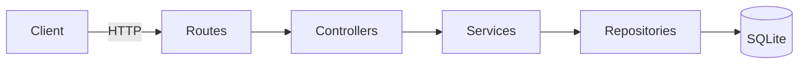

# Student Management API

A REST API for managing **students** and **products**, built with **FastAPI**, **SQLAlchemy** and **SQLite**, with **JWT login** protecting every change to the data.

## Features

- Full CRUD (Create, Read, Update, Delete) for students and products
- User registration and login with JWT tokens
- Anyone can read data; only logged-in users can create, update or delete it
- Search and pagination (`?search=`, `?skip=`, `?limit=`)
- Input validation (email format, age range, positive prices, and more)
- The same JSON response format everywhere: `{ status_code, data, message }`
- Passwords stored as salted PBKDF2 hashes, never as plain text
- Interactive API docs (Swagger UI) at `/docs`
- Automated tests with pytest

## Tech stack

| Part | Tool |
|---|---|
| Web framework | FastAPI |
| Server | Uvicorn |
| Database | SQLite (through the SQLAlchemy ORM) |
| Validation | Pydantic |
| Authentication | JWT (PyJWT) with PBKDF2 password hashing |
| Tests | pytest + FastAPI TestClient |

## Architecture

Each request passes through four layers. Each layer has one job:



| Layer | Folder | Job |
|---|---|---|
| Routes | `app/routes/` | Define URLs and HTTP methods; check input and login |
| Controllers | `app/controllers/` | Shape the response `{status_code, data, message}` |
| Services | `app/services/` | Business rules (e.g. "email must be unique", "404 if not found") |
| Repositories | `app/repositories/` | Talk to the database (queries, insert, update, delete) |

```
student-api/
├── app/
│   ├── main.py            # App setup, error handlers, routers
│   ├── config.py          # Settings loaded from .env
│   ├── database.py        # DB engine and sessions
│   ├── models.py          # Database tables
│   ├── schemas.py         # Request/response shapes + validation
│   ├── routes/  controllers/  services/  repositories/
│   └── utils/             # security.py (hashing, JWT), response.py
├── tests/                 # Automated tests
├── seed.py                # Adds demo data
├── setup.bat / run.bat    # Windows helper scripts
├── requirements.txt
└── .env.example
```

## Setup on Windows

**Requirement:** Python 3.9 or newer from [python.org](https://www.python.org/downloads/). During installation, tick **"Add python.exe to PATH"**.

### Option A: double-click (easiest)

1. Double-click **`setup.bat`**. It creates the virtual environment, installs the packages and makes a `.env` file with a random secret key. You only need to do this once.
2. Double-click **`run.bat`** to start the API.
3. Open **http://127.0.0.1:8000/docs** in your browser.

### Option B: Command Prompt / PowerShell

```bat
py -m venv .venv
.venv\Scripts\python -m pip install -r requirements.txt
copy .env.example .env
.venv\Scripts\python seed.py
.venv\Scripts\python -m uvicorn app.main:app --reload
```

> PowerShell tip: if `.venv\Scripts\Activate.ps1` gives a "running scripts is disabled" error, you don't need to activate it. Just call `.venv\Scripts\python` directly as shown above.

### macOS / Linux

```bash
python3 -m venv .venv
source .venv/bin/activate
pip install -r requirements.txt
cp .env.example .env
python seed.py
uvicorn app.main:app --reload
```

## Demo data

```bat
.venv\Scripts\python seed.py
```

This adds 5 students, 4 products and a demo login:

- **Email:** `demo@school.com`
- **Password:** `demo12345`

Running it again is safe, because it skips records that already exist.

## API endpoints

🔒 = needs a login token

| Method | URL | Description |
|---|---|---|
| POST | `/auth/register` | Create an account |
| POST | `/auth/login` | Log in and get a token |
| GET | `/auth/me` 🔒 | Show the logged-in user |
| GET | `/students?search=&skip=&limit=` | List or search students |
| GET | `/students/{id}` | Get one student |
| POST | `/students` 🔒 | Add a student |
| PUT | `/students/{id}` 🔒 | Update a student |
| DELETE | `/students/{id}` 🔒 | Delete a student |
| GET | `/products?search=&skip=&limit=` | List or search products |
| GET | `/products/{id}` | Get one product |
| POST | `/products` 🔒 | Add a product |
| PUT | `/products/{id}` 🔒 | Update a product |
| DELETE | `/products/{id}` 🔒 | Delete a product |

Example response:

```json
{
  "status_code": 201,
  "data": { "id": 1, "name": "Aarav Sharma", "email": "aarav@school.com", "age": 16, "course": "Computer Science" },
  "message": "Student created successfully"
}
```

## Presentation demo (about 5 minutes)

1. Run `seed.py`, start the server with `run.bat`, and open http://127.0.0.1:8000/docs
2. **GET /students** → shows the demo students (reading is public)
3. **GET /students?search=computer** → search in action
4. **POST /students** without logging in → **401 Unauthorized** (the data is protected)
5. **POST /auth/login** with `demo@school.com` / `demo12345` → copy the `access_token`
6. Click **Authorize** (top right), paste the token, click **Authorize**
7. **POST /students** again → **201 Created**
8. **POST /students** with `"age": 3` or a bad email → **422** with a clear error for each field
9. **PUT** and **DELETE** the new student → then **GET** it → **404 Not Found**
10. Run `pytest` in the terminal → all tests pass

## Running the tests

```bat
.venv\Scripts\python -m pytest -v
```

The tests use a separate in-memory database, so they never change your real data.

## Configuration (`.env`)

| Variable | Default | Meaning |
|---|---|---|
| `SECRET_KEY` | dev-only value | Key used to sign login tokens. Keep it secret |
| `DATABASE_URL` | `sqlite:///./students.db` | Where the data is stored |
| `ACCESS_TOKEN_EXPIRE_MINUTES` | `30` | How long a login token stays valid |
